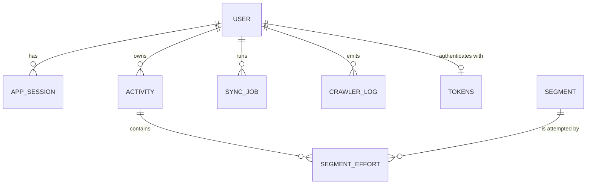

# Domain Driven Design (DDD)

**Last Updated:** 2026-04-27

This document describes the **domain model** of StravaHeatmap using Domain Driven Design concepts: **bounded contexts**, **aggregates**, **entities**, **value objects**, and **relationships**.

This repo is intentionally **Strava-first**: Strava’s API entities are the canonical domain shapes. See `docs/domain-model-strava.md` for the baseline.

## Bounded contexts

We keep boundaries simple and map them to the existing code structure.

### 1) Identity & Access (Auth)

- **Purpose**: identify the current user, maintain application sessions, and manage Strava OAuth tokens.
- **Primary code**:
  - `lib/services/auth-service.ts` (client-side session + token management)
  - `lib/services/auth-service-server.ts` (server-side auth helpers)
- **Primary persistence**: `users`, `app_sessions`, `tokens`

### 2) Activity Data (Read Model)

- **Purpose**: store and query Strava activity data for UI pages (activities list, segments pages, maps, stats).
- **Primary code**:
  - `lib/repositories/activities-repository.ts`
  - `lib/repositories/segments-repository.ts`
- **Primary persistence**: `activities`, `segments`, `segment_efforts` (and any derived/stat tables the repo uses)

### 3) Synchronization (Write / Orchestration)

- **Purpose**: fetch from Strava, respect rate limits, persist into the Activity Data context, and provide progress.
- **Primary code**:
  - `lib/services/strava-service.ts`
  - `lib/services/sync-orchestration-service.ts`
  - `lib/repositories/sync-jobs-repository.ts`
  - `lib/services/rate-limit-service.ts` (and analyzer utilities)
- **Primary persistence**: `sync_jobs`, crawler logs/tables where present

## Aggregates and entities

DDD terms used below:
- **Entity**: has a stable identity (id) over time.
- **Value Object**: identity-less, compared by value.
- **Aggregate**: a cluster of entities treated as a consistency boundary. We keep aggregates small.

### Aggregate: Athlete (User)

- **Entity**: `Athlete` (Strava user), persisted as a row in `users` (keyed by `strava_id`).
- **Why it’s an aggregate**: almost all persisted data is “owned by” a Strava athlete id; auth and sync operations are scoped to one athlete.

**Relationships**
- Athlete **1 → many** Activities (via `activities.strava_id`)
- Athlete **1 → many** SyncJobs (via `sync_jobs.strava_id`)
- Athlete **1 → many** AppSessions (via `app_sessions.strava_id`)
- Athlete **1 → 1** Tokens (current tokens; stored as rows keyed by `strava_id`)

### Aggregate: AppSession

- **Entity**: `AppSession` (server-validated session token with expiry), persisted in `app_sessions`.
- **Identity**: `session_token` is the practical identity; `id` may exist as db UUID.
- **Invariants**
  - A session is valid iff `expires_at > now()`.
  - Session tokens are treated as secrets.

### Aggregate: StravaTokens

- **Entity**: `StravaTokens`, persisted in `tokens`.
- **Identity**: `strava_id` (athlete id) is the natural key.
- **Fields (domain-relevant)**
  - `access_token`, `refresh_token`, `expires_at`
- **Invariants**
  - Tokens must be refreshable when near expiry.
  - Token refresh is the only writer for token rotation.

### Aggregate: Activity

- **Entity**: `Activity` (`StravaActivity`), persisted in `activities` (Strava `activity_id` is the canonical id).
- **Identity**
  - Strava: `activity.id`
  - Database: `activities.activity_id` (stored as-is)
- **Value objects commonly embedded**
  - `Polyline` (encoded route geometry), `Bounds`, `LatLng` (if/when persisted)
  - `ActivityType`, `SportType`, `StartDate`, `Duration`, `Distance`

**Relationships**
- Activity **belongs to** Athlete (`activities.strava_id`)
- Activity **1 → many** SegmentEfforts (by `segment_efforts.activity_id`)
- Activity **many → many** Segments through SegmentEfforts

### Aggregate: Segment

- **Entity**: `Segment` (`StravaSegment`), persisted in `segments` (keyed by Strava `segment_id`).
- **Relationships**
  - Segment **1 → many** SegmentEfforts (by `segment_efforts.segment_id`)

### Aggregate: SegmentEffort

- **Entity**: `SegmentEffort` (`StravaSegmentEffort`), persisted in `segment_efforts`.
- **Identity**
  - Strava effort id exists (`effort_id`)
  - Persistence in this repo is primarily “by link”: (`activity_id`, `segment_id`) is used as an upsert conflict key in `SegmentsRepository`.
- **Relationships**
  - SegmentEffort **belongs to** Activity
  - SegmentEffort **belongs to** Segment

### Aggregate: SyncJob

- **Entity**: `SyncJob`, persisted in `sync_jobs`.
- **Purpose**: represent a long-running orchestration (full sync, segments-only, etc.) and provide a stable id for polling UI.
- **Identity**: `sync_jobs.id` (UUID)
- **Value objects**
  - `SyncJobProgress` (nested counters by entity kind)
  - `RateLimitState` (when captured for pause/resume)
- **Invariants**
  - At most one **active** job per athlete (`pending` / `running` / `paused`) in normal operation.
  - Job transitions are append-only in meaning (pending → running → completed/failed/cancelled, with paused/resume in the middle).

### Entity: CrawlerLog (Monitoring)

- **Entity**: crawler execution log, commonly persisted as `strava_crawler_logs` (see `docs/crawler-architecture.md`).
- **Purpose**: operational observability (status, counts, rate limit info, durations).

## Relationship diagram (conceptual)

## Persistence mapping (tables)

These are the concrete Supabase tables that back the domain entities today.

- **Athlete (User)** → `users` (key: `strava_id`)
- **StravaTokens** → `strava_tokens` (key: `strava_id` → `users.strava_id`)
- **AppSession** → `app_sessions` (key: `session_token`, foreign key: `strava_id`)
- **Activity** → `activities` (key: `activity_id`, owner: `strava_id`)
- **Segment** → `segments` (key: `segment_id`)
- **SegmentEffort** → `segment_efforts`
  - keys: `effort_id` (unique) and `UNIQUE(activity_id, segment_id)`
  - foreign keys:
    - `segment_efforts.activity_id` → `activities.activity_id`
    - `segment_efforts.segment_id` → `segments.segment_id`
- **SyncJob** → `sync_jobs` (key: `id`, owner: `strava_id`)
  - pause/resume fields: `paused_at`, `resume_at`, `pause_reason`, `last_processed_activity_id`
- **CrawlerLog (Monitoring)** → `strava_crawler_logs` (foreign key: `user_id` → `users.strava_id`)

## Notes on “truth” and where it lives

- **Canonical domain shapes**: Strava entities in `types/strava.d.ts`.
- **Persistence shapes**: DB tables may add operational fields (`created_at`, `updated_at`, `segments_fetched`, etc.). These are **explicit extensions**.
- **Client state** (Zustand) is not part of the domain model; it should contain **UI state**, not persisted truth.

## Practical mapping to code folders

- **Entities / contracts**: `types/strava.d.ts`
- **Data access**: `lib/repositories/**`
- **Domain services (orchestration)**: `lib/services/**`
- **Use-cases exposed to UI**:
  - Server views: `app/**/page.tsx` (server components)
  - API endpoints: `app/api/**`

