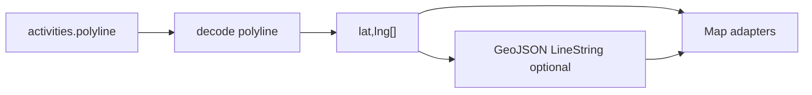
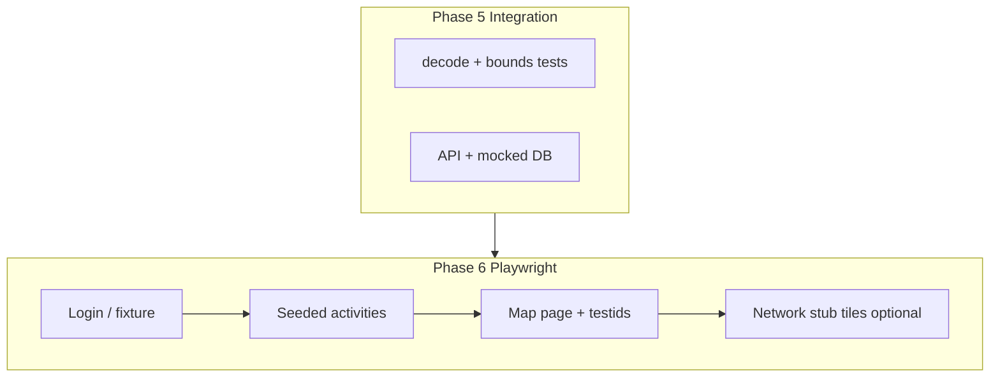

# Execution plan: activity polylines and map integration

This document describes how to visualize **encoded polylines per activity** and how to **combine them with any map stack** in StravaHeatmap.

**Current codebase context:** Strava/Google-encoded polylines live in `activities.polyline`; decoding uses `@mapbox/polyline` via **`lib/geo/polyline.ts`**; UI includes **`PolylineMap`** (SVG mini preview) and **`LeafletSegmentMap`** (Leaflet + configurable raster tiles).

**Legend:** ✅ Done · 🔜 Deferred / follow-up · ⏭️ Optional / not started

---

## Goals

| Goal | Status |
|------|--------|
| Per activity: polyline → coordinates → map | ✅ Core path implemented (`decodeActivityPolyline`, components) |
| “Any map”: stable geometry contract | ✅ `RouteGeometry` + GeoJSON `[lng, lat]`; adapters = swap tile URL / future GL |
| Integration + Playwright coverage | ✅ See phases 5–6 |

---

## Phase 0 — Normalize geometry (single source of truth)

| Step | Action | Status |
|------|--------|--------|
| 0.1 | Treat DB value as **encoded polyline** (Strava / Google). | ✅ |
| 0.2 | Decode with `@mapbox/polyline` → `Array<[lat, lng]>`. | ✅ `decodeActivityPolyline` |
| 0.3 | Optional **GeoJSON `LineString`** (`coordinates` as `[lng, lat][]`). | ✅ `RouteGeometry.geojson` |
| 0.4 | **Empty / null** polyline → null (no render). | ✅ |

---

## Phase 1 — Per-activity visualization pipeline

| Step | Action | Status |
|------|--------|--------|
| 1.1 | **Fetch** activity fields (`polyline`, etc.) — existing pages/API. | ✅ (existing data layer; no new API required for maps) |
| 1.2 | **Decode** in shared util `lib/geo/polyline.ts`. | ✅ |
| 1.3 | **Bounds** for fit / center. | ✅ `computeBounds`, used by Leaflet `fitBounds` |
| 1.4 | **Render** one path per activity. | ✅ Thumbnail + segment detail map |
| 1.5 | **Simplification** for long routes. | ✅ `decimateLatLngs` (cheap cap); Douglas–Peucker 🔜 |

**Reuse / refactor**

| Item | Status |
|------|--------|
| **`PolylineMap`** — thumbnails | ✅ Uses `projectPolylineToSvgPoints`, `data-testid="activity-route-map-thumb"` |
| **`LeafletSegmentMap`** — interactive route | ✅ `tileUrlTemplate`, `pathOptions`, `fitBounds`, `data-testid="route-map-leaflet"` |

---

## Phase 2 — “Any map” via adapters (combine geometry + map)

| Concept | Status |
|---------|--------|
| Stable **`RouteGeometry`** (`latlngs`, `bounds`, `geojson`) | ✅ Exported from `lib/geo/polyline.ts` |
| Parameterized **raster tiles** (Leaflet) | ✅ `tileUrlTemplate` prop |
| Second adapter (MapLibre / GL) | 🔜 |

---

## Phase 3 — Many activities on one map (combine routes)

| Step | Action | Status |
|------|--------|--------|
| 3.1 | Load N activities (paginate / bbox). | 🔜 |
| 3.2 | Decode each → **union bounds** → `fitBounds`. | ✅ `unionBounds` helper; dedicated page 🔜 |
| 3.3 | Layer groups / FeatureCollection | 🔜 |
| 3.4 | List ↔ map highlight UX | 🔜 |
| 3.5 | Cap N / simplify | ✅ `decimateLatLngs`; wiring 🔜 |

---

## Phase 4 — Product / ops checklist

| Item | Status |
|------|--------|
| Privacy / RLS | ⏭️ Ongoing (existing app rules) |
| Backfill missing polylines | ⏭️ Existing Strava detail sync |
| README: polyline → `RouteGeometry` | ✅ `README.md` + this doc |

---

## Phase 5 — Integration tests (basic)

| Step | Action | Status |
|------|--------|--------|
| 5.1 | Golden polylines, bounds, endpoints | ✅ `tests/integration/polyline-geometry.test.ts` |
| 5.2 | GeoJSON `[lng, lat]` contract | ✅ Same file |
| 5.3 | API route + mocked Supabase for activity JSON | 🔜 (`/api/activities` can be covered when contract stabilizes) |
| 5.4 | Empty / null polyline contract | ✅ Covered in 5.1 + E2E fixture section |

---

## Phase 6 — E2E tests (Playwright)

Config: **`playwright.config.ts`** — `testDir: ./tests/e2e`, `baseURL: http://localhost:3001`, `webServer: yarn dev`.

| Step | Action | Status |
|------|--------|--------|
| 6.1 | Fixtures / auth | ✅ Dev-only page — **no Strava OAuth** (`/e2e-fixtures/route-map`, 404 in production) |
| 6.2 | Seed / known polyline | ✅ Inline golden string in fixture client |
| 6.3 | Stable **`data-testid`** | ✅ Thumb + Leaflet wrapper |
| 6.4 | DOM assertions; stub OSM tiles | ✅ `page.route` abort tiles in `polyline-map.spec.ts` |
| 6.5 | Scenarios: thumb + Leaflet + empty polyline | ✅ `tests/e2e/polyline-map.spec.ts` |
| 6.6 | CI: `yarn test:e2e` | ⏭️ Ensure CI runs `npx playwright install` (browsers); document in `docs/testing-strategy.md` 🔜 |

---

## Suggested build order (execution log)

| # | Task | Status |
|---|------|--------|
| 1 | `lib/geo/polyline.ts` + Phase 5.1 tests | ✅ |
| 2 | Refactor `LeafletSegmentMap` + testids | ✅ |
| 3 | Activity row / detail map + E2E with seed | 🔜 (segment detail already uses Leaflet; activities page can add map later) |
| 4 | Multi-activity map + integration/E2E | 🔜 |
| 5 | Second adapter (MapLibre) | 🔜 |
| 6 | CI Playwright browser install docs | 🔜 |

---

## Summary

**Normalize polylines once** (`lib/geo/polyline.ts`), **render through shared geometry**, **swap raster tiles** on Leaflet, **combine routes** with `unionBounds` when you add a multi-activity page. **Integration tests** cover decode/GeoJSON/bounds; **Playwright** covers SVG + Leaflet smoke on a **dev-only fixture** with **stubbed tiles**.
